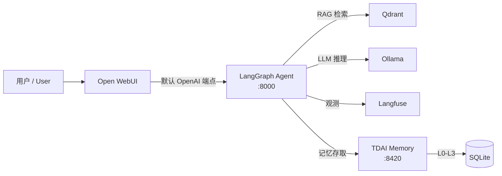

# 企业知识库平台 / Enterprise Knowledge Base Platform

基于 **LangGraph** + **Qdrant** + **Open WebUI** 的企业级智能问答平台，全容器化部署。集成 **TencentDB Agent Memory** 四层记忆系统，实现 Agent 长期记忆持久化。

Enterprise-grade intelligent Q&A platform built on **LangGraph**, **Qdrant**, and **Open WebUI** — fully containerized. Integrated with **TencentDB Agent Memory** for persistent long-term memory.

---

## 服务架构 / Service Architecture

```
┌──────────────────────────────────────────────────────────────────┐
│                          Nginx (:443/80)                          │
│                       反向代理 / Reverse Proxy                     │
└──┬──────────┬────────────┬──────────────┬───────────────────────┘
   │          │            │              │
   ▼          ▼            ▼              ▼
┌──────┐ ┌────────┐ ┌───────────┐ ┌──────────────┐ ┌────────────┐
│Open  │ │LangGraph│ │RAG        │ │Langfuse      │ │TDAI Memory │
│WebUI │ │Agent   │ │Pipeline   │ │Dashboard     │ │Gateway     │
│:3000 │ │:8000   │ │:8001      │ │:3001         │ │:8420       │
└──┬───┘ └───┬────┘ └─────┬─────┘ └──────┬───────┘ └──────┬─────┘
   │         │            │              │                │
   └─────────┼────────────┼──────────────┘                │
             │            │                               │
             ▼            ▼                               ▼
       ┌──────────┐ ┌──────────┐                  ┌──────────┐
       │ Qdrant   │ │ Ollama   │                  │ SQLite   │
       │ (:6333)  │ │ (:11434) │                  │ (L0-L3)  │
       └──────────┘ └──────────┘                  └──────────┘
```

### 服务列表 / Service Overview

| 服务 / Service | 端口 / Port | 说明 / Description |
|---|---|---|
| **Open WebUI** | `:3000` | AI 聊天前端 / AI Chat Frontend |
| **LangGraph Agent** | `:8000` | 智能体 API 服务 / Agent API Service |
| **RAG Pipeline** | `:8001` | 文档处理流水线 / Document Processing Pipeline |
| **Langfuse** | `:3001` | 可观测性平台 / Observability Platform |
| **TDAI Memory** | `:8420` | 四层长期记忆系统（新增） / 4-Layer Long-Term Memory (New) |
| **Qdrant** | `:6333` | 向量数据库 / Vector Database |
| **PostgreSQL** | `:5432` | Langfuse 主数据库 / Langfuse Primary DB |
| **ClickHouse** | `:8123` | Langfuse 事件存储 / Langfuse Event Store |
| **Redis** | `:6379` | 缓存 / Cache |
| **MinIO** | `:9000` | S3 对象存储 / Object Storage |
| **Ollama** | `:11434` | 本地 LLM（宿主机直连 / Host Direct） |

---

## 🧠 TDAI Memory — 四层长期记忆系统

集成 [TencentDB Agent Memory](https://github.com/TencentCloud/TencentDB-Agent-Memory) 作为 **Sidecar 容器**，为 LangGraph Agent 提供持久化长期记忆能力。

### 记忆架构

| 层级 | 名称 | 内容 |
|------|------|------|
| **L0** | Conversation | 原始对话记录 |
| **L1** | Atom | 原子化事实提取 |
| **L2** | Scenario | 场景归类与上下文 |
| **L3** | Persona | 用户画像与偏好 |

### 工作流程

```
用户提问
   │
   ├── ① TDAI 召回（sync_recall）
   │      └── 相关历史记忆 → SystemMessage 注入到 LLM 上下文
   │
   ├── ② LangGraph 图执行（不变）
   │      ├── intent_router → 意图分类
   │      ├── rag_fetch / code_search → 知识库 / 代码搜索
   │      └── agent_orchestrator → ReACT 子图 + 工具调用
   │
   ├── ③ TDAI 保存（sync_capture）
   │      └── Q&A 发送至 Gateway → L0-L1-L2-L3 异步提取管线
   │
   └── ④ 返回最终答案
```

### 特性

- **渐进式记忆** — 从高层画像（L3）逐步下钻到原始对话（L0），只在上下文中保留轻量抽象
- **混合检索** — BM25 关键词 + sqlite-vec 向量搜索 + RRF 融合排序
- **白盒调试** — 所有记忆以 Markdown 文件 + Mermaid 图表形式存储，可人工阅读调优
- **零侵入** — 所有 TDAI 调用包在 try/except 中，失败不影响主流程，`TDAI_ENABLED=false` 一键关闭

---

## 📦 部署 / Deployment

### 前置条件 / Prerequisites

- [Docker Desktop](https://www.docker.com/products/docker-desktop/)
- [Ollama](https://ollama.com/)（宿主机运行 / Run on host）
- 已拉取所需模型 / Required LLM models pulled

### 快速启动 / Quick Start

```powershell
# 启动所有服务 / Start all services
.\docker-data\scripts\start-all.ps1

# 或在 D:\docker-data 目录直接运行 / Or run directly:
docker compose -f D:/docker-data/docker-compose.all.yml up -d
```

### 首次启动 TDAI Memory（构建镜像）

```powershell
docker compose -f D:/docker-data/docker-compose.all.yml build tdai-memory
docker compose -f D:/docker-data/docker-compose.all.yml up -d
```

验证记忆服务：
```powershell
curl http://localhost:8420/health
```

### 服务地址 / Service URLs

| 服务 / Service | 地址 / URL |
|---|---|
| **Open WebUI** | http://localhost:3000 |
| **LangGraph Agent API** | http://localhost:8000 |
| **RAG Pipeline** | http://localhost:8001 |
| **Langfuse** | http://localhost:3001 |
| **TDAI Memory** | http://localhost:8420 |
| **Qdrant** | http://localhost:6333 |
| **Ollama** | http://localhost:11434 |

---

## 🔄 本地修改后一键重新部署 / One-Click Redeploy After Local Changes

所有服务均在 Docker 中运行。当你在本地修改了代码后，只需两条命令即可重新构建并部署：

```powershell
docker compose -f D:/docker-data/docker-compose.all.yml build    # 重新构建镜像 / Rebuild images
docker compose -f D:/docker-data/docker-compose.all.yml up -d   # 重启容器 / Restart containers
```

### 各服务构建要点 / Build Notes per Service

| 服务 / Service | 构建类型 | 说明 / Notes |
|---|---|---|
| **langgraph-agent** | Docker 构建 | `build` 指向 `langgraph-agent/Dockerfile`，自动复制源码 |
| **tdai-memory** | Docker 构建 | 轻量镜像，从 npm 安装 TDAI Gateway（仅首次/Ollama模型变更时需要） |
| **open-webui** | 官方镜像 | 无需构建，修改通过环境变量和挂载卷生效 |
| **rag-pipeline** | Docker 构建 | `rag-pipeline/Dockerfile`，需单独构建 |
| **其他基础设施** | 官方镜像 | 无需构建 |

### 一键重新部署脚本 / One-Click Redeploy Script

```powershell
# 重新构建并部署所有本地修改的服务（推荐）
& {
    Write-Host "🔨 重新构建镜像 / Rebuilding images..." -ForegroundColor Cyan
    docker compose -f D:/docker-data/docker-compose.all.yml build langgraph-agent
    Write-Host "🚀 重启容器 / Restarting containers..." -ForegroundColor Cyan
    docker compose -f D:/docker-data/docker-compose.all.yml up -d
    Write-Host "✅ 完成 / Done" -ForegroundColor Green
}
```

> **💡 提示**: `build` 命令可以用 `--no-cache` 参数强制完整重新构建：
> ```powershell
> docker compose -f D:/docker-data/docker-compose.all.yml build --no-cache langgraph-agent
> ```

---

## 🤖 Open WebUI 默认指向 LangGraph Agent / Open WebUI Defaults to LangGraph Agent

### 为什么 Open WebUI 默认连到 langgraph-agent？/ Why the Default?

Open WebUI 默认配置为通过 **OpenAI 兼容接口** 连接到 langgraph-agent，而不是直接连接 Ollama。这样做的原因：

1. **智能路由** — langgraph-agent 自动判断用户意图（RAG 检索 / 代码搜索 / 工具调用 / 通用对话），然后选择合适的处理路径
2. **企业知识库** — 用户无需手动切换模型或知识库，所有 RAG 检索由 langgraph-agent 自动完成
3. **长期记忆** — langgraph-agent 自动与 TDAI Memory 交互，保存和召回历史对话，Agent 能"记住"用户偏好和历史信息
4. **统一可观测性** — 所有请求通过 langgraph-agent 记录到 Langfuse，实现全链路追踪
5. **安全控制** — API 密钥认证、速率限制、命令沙箱等安全机制由 langgraph-agent 统一管理



### 配置方式 / How It's Configured

在 `docker-compose.all.yml` 中，Open WebUI 的环境变量配置如下：

```yaml
open-webui:
  image: openwebui/open-webui:latest
  environment:
    - OLLAMA_BASE_URL=http://host.docker.internal:11434   # Ollama 连接
    - WEBUI_AUTH=true                                      # 启用认证
    - RAG_EMBEDDING_ENGINE=ollama                          # 嵌入引擎
    - RAG_EMBEDDING_MODEL=bge-m3                           # 嵌入模型
```

用户在 Open WebUI 的 **管理员设置 → 外部连接 → OpenAI API** 中需手动添加：

| 设置 / Setting | 值 / Value |
|---|---|
| **API URL** | `http://host.docker.internal:8000`（Docker 内访问宿主机）或 `http://kb-langgraph-agent:8000`（同一 Docker 网络内） |
| **API Key** | 留空或配置 `API_KEY`（如果已启用密钥认证） |

> 配置完成后，用户在对话页面选择 OpenAI 类型即可使用 langgraph-agent，所有对话将自动使用企业知识库、智能体工具和长期记忆。

### Nginx 反向代理模式

如果通过 Nginx 访问 Open WebUI，Nginx 已将 `/api/` 路径代理到 `langgraph-agent:8000`，因此 Open WebUI 可以配置 API 地址为 `http://nginx/api/`（见 [nginx/nginx.conf](nginx/nginx.conf)）。

---

## 📁 项目结构 / Project Structure

```
D:\local-agent\              # 源码目录 / Source Code
├── langgraph-agent/         # 智能体 API 服务 / Agent API
│   ├── Dockerfile
│   ├── src/
│   │   ├── agent/graph.py      # LangGraph 图编排（含 TDAI 记忆集成）
│   │   ├── tdai_client.py      # TDAI Memory HTTP 客户端（新增）
│   │   ├── config.py           # 配置（含 TDAI_* 配置项）
│   │   ├── api/routes.py       # FastAPI 路由
│   │   └── ...
│   ├── requirements.txt
│   └── README.md
├── rag-pipeline/            # 文档处理流水线 / Doc Pipeline
│   ├── Dockerfile
│   └── api.py
├── langfuse/                # 可观测性 / Observability
├── .claude/                 # Claude Code 配置
├── data/                    # 本地数据
├── monitoring/              # 监控配置
├── README.md
├── AUDIT.md
└── REMEDIATION.md

D:\docker-data\              # 部署资源目录 / Deployment Resources
├── docker-compose.all.yml   # 统一编排文件（含 tdai-memory 服务）
├── .env.example             # 环境变量模板
├── docker/
│   └── tdai-memory/
│       └── Dockerfile       # TDAI Memory 轻量镜像（新增）
├── scripts/
│   ├── start-all.ps1        # 一键启动脚本 / One-Click Start
│   ├── backup.ps1           # 数据备份 / Backup
│   └── generate-certs.ps1   # SSL 证书生成 / SSL Certs
├── nginx/
│   └── nginx.conf           # 反向代理配置 / Reverse Proxy Config
└── data/                    # 数据持久化 / Data Persistence
    ├── langfuse/            # PostgreSQL, Redis, MinIO 数据
    ├── qdrant/              # 向量数据库存储
    ├── open-webui/          # WebUI 数据
    ├── tdai-memory/         # TDAI 记忆数据（新增）SQLite L0-L3
    ├── logs/                # 日志
    └── hf_cache/            # HuggingFace 缓存
```

---

## 📝 常用命令 / Common Commands

```powershell
# 启动所有服务 / Start all services
.\docker-data\scripts\start-all.ps1

# 停止所有服务 / Stop all services
docker compose -f D:/docker-data/docker-compose.all.yml down

# 查看运行状态 / Check running status
.\docker-data\scripts\start-all.ps1 --status

# 健康检查 / Health check
.\docker-data\scripts\start-all.ps1 --health

# TDAI 记忆服务健康检查 / TDAI Memory health check
curl http://localhost:8420/health

# 查看日志 / View logs
docker compose -f D:/docker-data/docker-compose.all.yml logs -f langgraph-agent
docker compose -f D:/docker-data/docker-compose.all.yml logs -f open-webui
docker compose -f D:/docker-data/docker-compose.all.yml logs -f tdai-memory

# 进入容器 / Enter container
docker exec -it kb-langgraph-agent bash

# 重新构建并重启单个服务 / Rebuild & restart a single service
docker compose -f D:/docker-data/docker-compose.all.yml build langgraph-agent
docker compose -f D:/docker-data/docker-compose.all.yml up -d langgraph-agent
```

---

## 🔧 环境变量 / Environment Variables

参考 [.env.example](.env.example) 文件，复制为 `.env` 并修改相应值。

Refer to [.env.example](.env.example), copy to `.env` and modify values as needed.

### TDAI Memory 配置项

| 变量 | 默认值 | 说明 |
|------|--------|------|
| `TDAI_GATEWAY_URL` | `http://tdai-memory:8420` | Gateway 地址（Docker 内 / 本地开发） |
| `TDAI_ENABLED` | `true` | 启用/禁用记忆存取 |
| `TDAI_RECALL_TOP_K` | `5` | 记忆召回数量 |

---

## ⚠️ 注意事项 / Notes

1. **Ollama 必须在宿主机运行**，Docker 容器通过 `host.docker.internal` 访问
2. **路径挂载** 使用了 Windows 绝对路径，确保对应目录存在
3. **首次启动** langfuse-web 需要执行数据库迁移，可能需要等待 1-2 分钟
4. **TDAI Memory** 首次运行时需构建镜像：`docker compose build tdai-memory`；数据存储在 `D:/docker-data/data/tdai-memory/`
5. **API 认证**：可通过设置 `API_KEY` 环境变量启用密钥认证
6. **记忆系统容错**：TDAI 调用失败不会影响核心问答流程，可通过设置 `TDAI_ENABLED=false` 完全关闭
